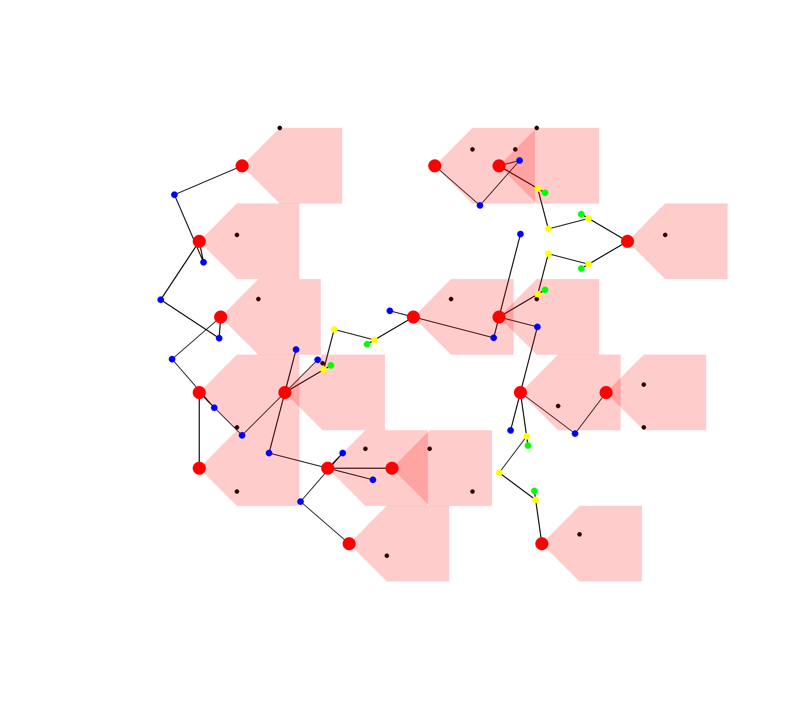

# Implementation of the paper "Target Coverage and Connectivity Problem in Directional Wireless Sensor Networks"

## Requirement:
```
g++10 (The code has been tested on Ubuntu 20.04.)
```
If you want to visualize the graph, you need to install `X11` (to use `[CImg](https://github.com/dtschump/CImg)`).

## To build and run
```
git clone https://github.com/lamductan/DCTC
unzip third_party.zip
mkdir build
cd build
cmake ..
make
./test/tests
```

## To run all simulations
* Run `bash test_script.sh`.
* Results are saved in `results/{yyyy-mm-dd-HH-MM-SS}/fixed_rs.csv` and `results/{yyyy-mm-dd-HH-MM-SS}/fixed_rc.csv`, where `{yyyy-mm-dd-HH-MM-SS}` is the timestamp of running the script. (Paths to the result files are also echo-ed on the terminal).

## To visualize an input graph (of small size) and results of the algorithms on this input:
1. Run test in file `test/src/dctc/network_components/test_save_graph.cpp`.
2. After the test is run, the input instance and the result graphs are saved in the folder `visualization/samples`. 
3. Then `cd visualization` and run the command `bash build_and_run.sh`.

## Examples of some output graphs
```
Black: targets
Red: Coverage sensors (terminals)
Green: Type-1 relays
Yellow: Type-2 relays
Cyan: Type-3 relays
Blue: Type-4 (short edge) relays
```
**Input targets together with the coverage sensors outputted by Strip-based algorithm and the MST over the set of sensors: 21 sensors are needed**


**Aschner's algorithm: 73 sensors are needed, beta = 3.476**


**Tran's algorithm: 84 sensors are needed, beta = 4.000**


**Lam's LongEdgeFirst algorithm: 58 sensors are needed, beta = 2.762**

